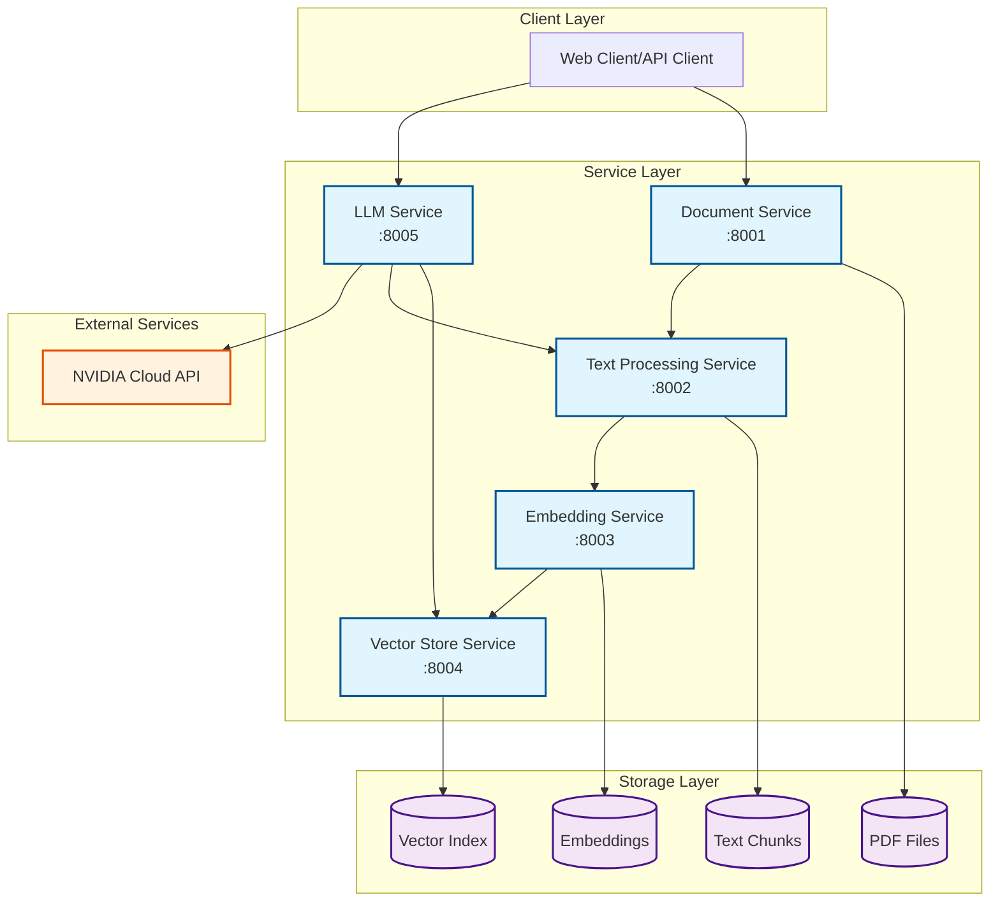
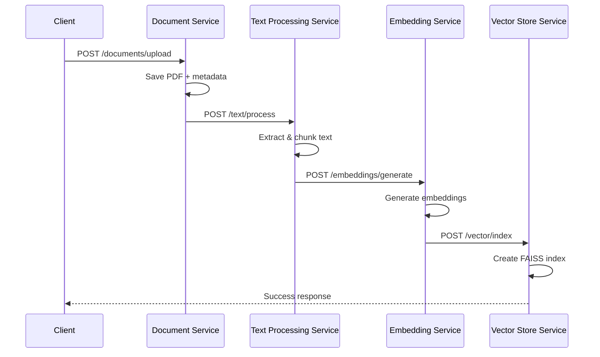
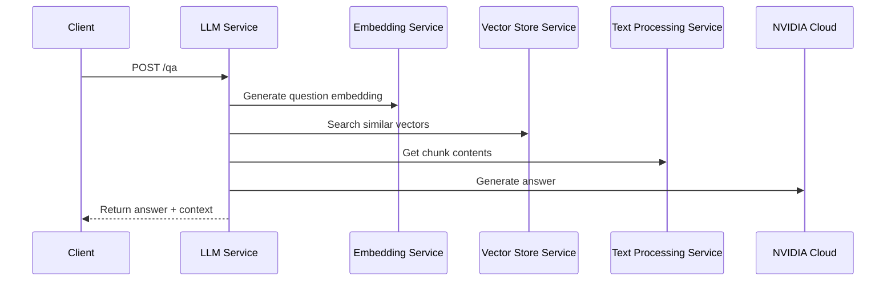

# 🏗️ RAGマイクロサービス アーキテクチャ

## システム概要

RAGマイクロサービスシステムは、Retrieval-Augmented Generation (RAG) を実現する5つの独立したマイクロサービスで構成されています。

## アーキテクチャ図

## サービス詳細

### 1. Document Service (Port: 8001)

**責任**: PDFファイルの管理・メタデータ保存

**主要機能**:
- PDFファイルのアップロード
- ドキュメントメタデータ管理
- ファイル検索・取得

**技術スタック**: FastAPI, PyPDF2, pdfplumber

### 2. Text Processing Service (Port: 8002)

**責任**: テキストの前処理・チャンク分割

**主要機能**:
- ドキュメントからのテキスト抽出
- インテリジェントチャンク分割
- メタデータ付与

**技術スタック**: FastAPI, Python標準ライブラリ

### 3. Embedding Service (Port: 8003)

**責任**: テキストのベクトル埋め込み生成

**主要機能**:
- SentenceTransformersによる埋め込み生成
- バッチ処理対応
- キャッシュ機能

**技術スタック**: FastAPI, SentenceTransformers, all-MiniLM-L6-v2

### 4. Vector Store Service (Port: 8004)

**責任**: ベクトル検索・インデックス管理

**主要機能**:
- FAISSベースの高速ベクトル検索
- インデックス作成・管理
- 類似度検索

**技術スタック**: FastAPI, FAISS, NumPy

### 5. LLM Service (Port: 8005)

**責任**: 質問応答・RAG統合

**主要機能**:
- NVIDIA Cloud API連携
- RAGパイプライン統合
- 質問応答処理

**技術スタック**: FastAPI, NVIDIA Cloud API, httpx

## データフロー

### ドキュメント登録フロー

### 質問応答フロー

## セキュリティ考慮事項

### 認証・認可
- 現在：基本的なサービス間通信のみ
- 推奨：JWT ベース認証、API Key管理

### データ保護
- ファイル暗号化
- 通信の HTTPS 化
- 機密情報のマスキング

### ネットワークセキュリティ
- Docker 内部ネットワーク使用
- 不要ポートの非公開
- ファイアウォール設定

## スケーラビリティ

### 水平スケーリング
- 各サービスは独立してスケール可能
- ロードバランサーによる負荷分散
- Kubernetes でのオートスケーリング

### パフォーマンス最適化
- Redis キャッシュ導入
- 非同期処理の活用
- バッチ処理の並列化

## 監視・運用

### ヘルスチェック
- 各サービスに `/health` エンドポイント
- Docker Compose ヘルスチェック設定
- 外部監視システム連携

### ログ・メトリクス
- 構造化ログ出力
- Prometheus メトリクス
- 分散トレーシング (Jaeger)

### 障害対応
- サーキットブレーカーパターン
- リトライ・タイムアウト設定
- 优雅な劣化

## 今後の拡張予定

### 短期 (1-2ヶ月)
- API Gateway 導入
- Web UI 開発
- 監視システム構築

### 中期 (3-6ヶ月)
- Kubernetes 対応
- マルチテナント機能
- 高度な検索機能

### 長期 (6ヶ月以上)
- MLOps パイプライン
- A/B テスト機能
- エッジデプロイメント